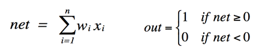
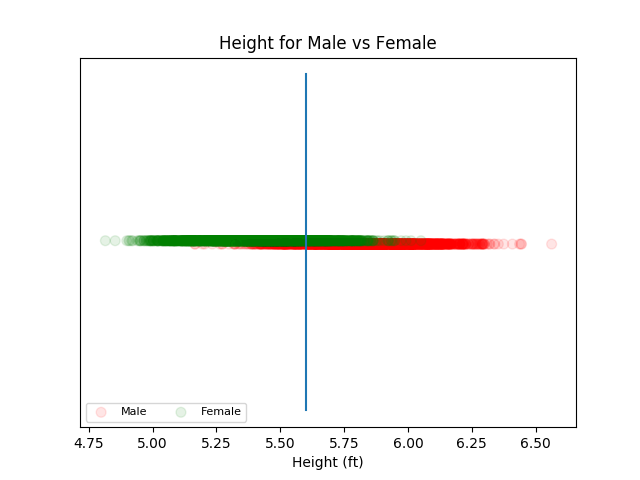
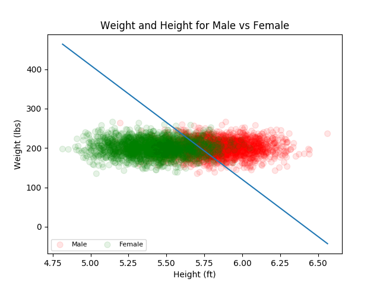

# Project 1 Report

## CMSC 409 - Artificial Intelligence

## Steven Hernandez

Fully generated data can be found in `./Project1_data/data.txt

### *Scenerio 1:* using only height.

|  | Weights | 
| --- | --- | 
| x | 1.0 | 
| bias | 5.6 | 

Assuming the following

\ 

Or in this situation: 

1 if 0 <= -a(Height) + bias, otherwise 0

where *a* is some weight and *1* is male and *0* is female.

In this situation a=1.0 and bias=5.6

\ 

|  | Predicted Male | Predicted Female | 
| --- | --- | --- | 
| Actual Male | 1774 | 226 | 
| Actual Female | 371 | 1629 | 

**Confusion Matrix**

|  |  | 
| --- | --- | 
| Error | 0.14925 | 
| Accuracy | 0.85075 | 
| True Positive Rate | 0.887 | 
| True Negative Rate | 0.8145 | 
| False Positive Rate | 0.1855 | 
| False Negative Rate | 0.113 | 

### *Scenerio 2:* heights and weights.

|  | Weights | 
| --- | --- | 
| x | -290 | 
| y | 1 | 
| bias | 1860 | 

Assuming the following

\ 

Or in this situation:

1 if 0 <= a(Height) - b(Weight) + bias, otherwise 0

where *a* and *b* are some weights and *1* is male and *0* is female.

In this situation a=-290 and b=1 and bias=1860

\ 

Notice, Male and Female are on slightly different levels in this graphso that one does not completely cover up the other.

**Confusion Matrix**

|  | Predicted Male | Predicted Female | 
| --- | --- | --- | 
| Actual Male | 1420 | 580 | 
| Actual Female | 37 | 1963 | 

|  |  | 
| --- | --- | 
| Error | 0.15425 | 
| Accuracy | 0.84575 | 
| True Positive Rate | 0.71 | 
| True Negative Rate | 0.9815 | 
| False Positive Rate | 0.0185 | 
| False Negative Rate | 0.29 | 

### Libraries Used

matplotlib, numpy, pandas, pandoc

### Selected Code Functions

Functions used to generate this data and calculations.

The full code can be found in `./project1.py`

```

def generate_random_data():
    data_file = open(dataFileName, "w")

    for gender in range(0, 2):
        height_mean = 70 / 12 if gender == 0 else 65 / 12
        weight_mean = 200 if gender == 0 else 165

        for i in range(0, 2000):
            # generate random heights and weights in a `normalized` way
            height = np.random.normal(height_mean, 0.2)
            weight = np.random.normal(weight_mean, 20)

            data_file.write(str(height) + "," + str(weight) + "," + str(gender) + "\n")

    data_file.close()

```

```

def plot_male_and_females(data_frame, remove_y_axis=False):
    males, females = separate_males_and_females(data_frame)

    male_x = males[0]
    male_y = np.full(males[0].shape, -0.001) if remove_y_axis else males[1]

    female_x = females[0]
    female_y = np.full(males[0].shape, 0.001) if remove_y_axis else males[1]

    male_plot = plt.scatter(male_x, male_y, s=area, c=np.full(males[2].shape, 'r'), alpha=alpha)
    female_plot = plt.scatter(female_x, female_y, s=area, c=np.full(females[2].shape, 'g'), alpha=alpha)

    plt.legend((male_plot, female_plot),
               ('Male', 'Female'),
               scatterpoints=1,
               loc='lower left',
               ncol=3,
               fontsize=8)

    if remove_y_axis:
        plt.title("Height for Male vs Female")
        plt.xlabel("Height (ft)")
    else:
        plt.title("Weight and Height for Male vs Female")
        plt.xlabel("Height (ft)")
        plt.ylabel("Weight (lbs)")

```

```

def plot_male_and_females(data_frame, remove_y_axis=False):
    males, females = separate_males_and_females(data_frame)

    male_x = males[0]
    male_y = np.full(males[0].shape, -0.001) if remove_y_axis else males[1]

    female_x = females[0]
    female_y = np.full(males[0].shape, 0.001) if remove_y_axis else males[1]

    male_plot = plt.scatter(male_x, male_y, s=area, c=np.full(males[2].shape, 'r'), alpha=alpha)
    female_plot = plt.scatter(female_x, female_y, s=area, c=np.full(females[2].shape, 'g'), alpha=alpha)

    plt.legend((male_plot, female_plot),
               ('Male', 'Female'),
               scatterpoints=1,
               loc='lower left',
               ncol=3,
               fontsize=8)

    if remove_y_axis:
        plt.title("Height for Male vs Female")
        plt.xlabel("Height (ft)")
    else:
        plt.title("Weight and Height for Male vs Female")
        plt.xlabel("Height (ft)")
        plt.ylabel("Weight (lbs)")

```

```

def get_confusion_matrix(data_frame, sep_line):
    true_positive = 0
    true_negative = 0
    false_positive = 0
    false_negative = 0

    for row in data_frame.iterrows():
        r = row[1]

        if len(sep_line[0]) == 3:
            height = r[0]
            weight = r[1]
            gender = r[2]
            x_weight = sep_line[0][0]
            y_weight = sep_line[0][1]
            bias = sep_line[0][2]

            # 0 <= bx + x - ay
            if (x_weight * height) + bias - (y_weight * weight) >= 0:
                if gender == 1:
                    true_positive += 1
                else:
                    false_positive += 1
            else:
                if gender == 0:
                    true_negative += 1
                else:
                    false_negative += 1
        else:
            height = r[0]
            weight = r[1]
            gender = r[2]
            x_weight = sep_line[0][0]
            bias = sep_line[0][1]

            # 0 <= bx - c
            net = x_weight * height - bias * 1

            if net < 0:
                if gender == 1:
                    true_positive += 1
                else:
                    false_positive += 1
            else:
                if gender == 0:
                    true_negative += 1
                else:
                    false_negative += 1

    return (true_positive,
            true_negative,
            false_positive,
            false_negative)

```

