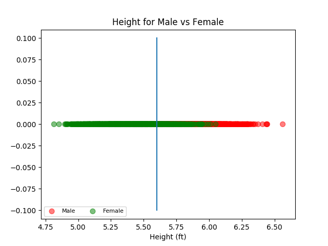
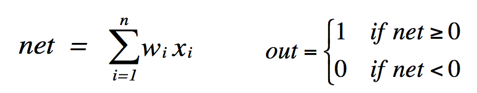
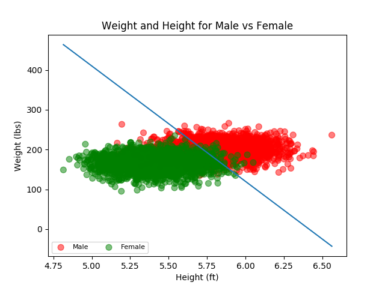

# Project 1 Report

## CMSC 409 - Artificial Intelligence

## Steven Hernandez

### *Scenerio 1* using only height.

|  | Weights | 
| --- | --- | 
| x | 1.0 | 
| bias | 5.6 | 



Assuming the following



Or in this situation: 

1 if 0 <= -a(Height) + bias, otherwise 0

where *a* is some weight and *1* is male and *0* is female.

|  | Predicted Male | Predicted Female | 
| --- | --- | --- | 
| Actual Male | 1774 | 226 | 
| Actual Female | 371 | 1629 | 

### *Scenerio 2* heights and weights.

|  | Weights | 
| --- | --- | 
| x | -290 | 
| y | 1 | 
| bias | 1860 | 



Assuming the following


Or in this situation:

1 if 0 <= a(Height) - b(Weight) + bias, otherwise 0

where *a* and *b* are some weights and *1* is male and *0* is female.

where w_i is weight and 

|  | Predicted Male | Predicted Female | 
| --- | --- | --- | 
| Actual Male | 1420 | 580 | 
| Actual Female | 37 | 1963 | 

### Selected Code Functions

Functions used to generate this data and calculations.

```
def get_confusion_matrix(data_frame, sep_line):
    true_positive = 0
    true_negative = 0
    false_positive = 0
    false_negative = 0

    # Note, this is only going to be for x,y,bias for now
    for row in data_frame.iterrows():
        r = row[1]

        if len(sep_line[0]) == 3:
            height = r[0]
            weight = r[1]
            gender = r[2]
            x_weight = sep_line[0][0]
            y_weight = sep_line[0][1]
            bias = sep_line[0][2]

            # 0 <= bx + x - ay
            if (x_weight * height) + bias - (y_weight * weight) >= 0:
                if gender == 1:
                    true_positive += 1
                else:
                    false_positive += 1
            else:
                if gender == 0:
                    true_negative += 1
                else:
                    false_negative += 1
        else:
            height = r[0]
            weight = r[1]
            gender = r[2]
            x_weight = sep_line[0][0]
            bias = sep_line[0][1]

            # 0 <= bx - c
            # or y = (x_weight/a)y_weight + (bias/y_weight)
            net = x_weight * height - bias * 1

            if net < 0:
                if gender == 1:
                    true_positive += 1
                else:
                    false_positive += 1
            else:
                if gender == 0:
                    true_negative += 1
                else:
                    false_negative += 1

    return (true_positive,
            true_negative,
            false_positive,
            false_negative)

```

### Libraries Used

matplotlib, numpy, pandas

