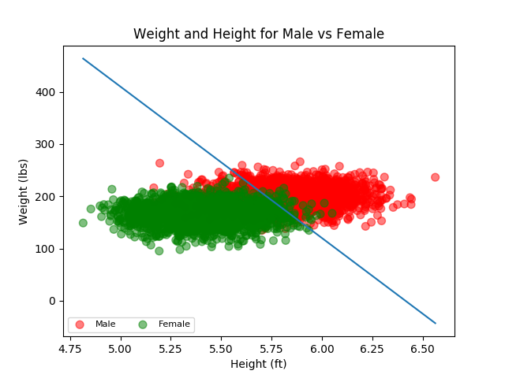

# Project 1 Report

## CMSC 409 - Artificial Intelligence

## Steven Hernandez



```
def get_confusion_matrix(data_frame, sep_line):
    truePositive = 0
    trueNegative = 0
    falsePositive = 0
    falseNegative = 0

    # Note, this is only going to be for x,y,bias for now
    for row in data_frame.iterrows():
        r = row[1]
        height = r[0]
        weight = r[1]
        gender = r[2]

        xWeight = sep_line[0][0]
        yWeight = sep_line[0][1]
        bias = sep_line[0][2]

        # print("y = " + str(xWeight / yWeight) + "x" + " + " + str(bias / yWeight))

        # 0 = bx + x - ay
        if (xWeight * height) + bias - (yWeight * weight) >= 0:
            if gender == 1:
                truePositive += 1
            else:
                falsePositive += 1
        else:
            if gender == 0:
                trueNegative += 1
            else:
                falseNegative += 1

    return (truePositive,
            trueNegative,
            falsePositive,
            falseNegative)

```

|  | Predicted Male | Predicted Female | 
| --- | --- | --- | 
| Actual Male | 1420 | 580 | test | 
| Actual Female | 37 | 1963 | 

