    

You will notice for each scenario, there are 4 graphs.

| Final sep_line after learning | Graph of all sep_lines during learning | 
| ---------------------------------------- | ---------------------------------------- | 
| Graph of errors (blue: training set error, gray: testing set error) | Change of weights over time. | 

### Hard Activation With A Sample Size Of 25%

\ 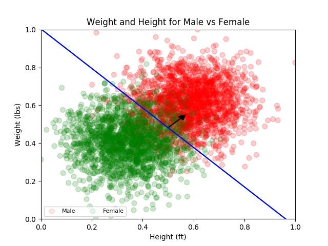{#id .class width=300 height=200} \ 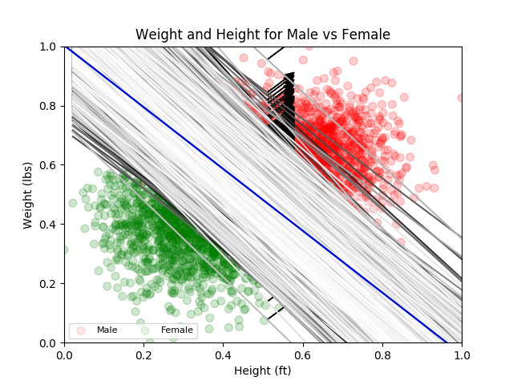{#id .class width=300 height=200} 

\ 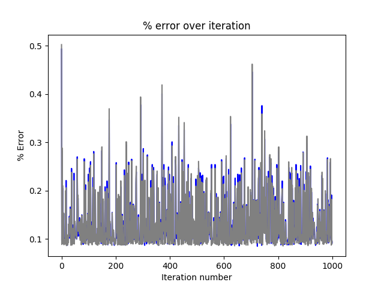{#id .class width=300 height=200} \ 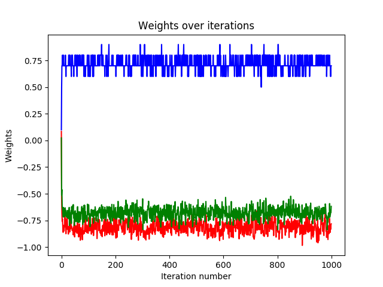{#id .class width=300 height=200} 

\pagebreak

### Hard Activation With A Sample Size Of 50%

\ 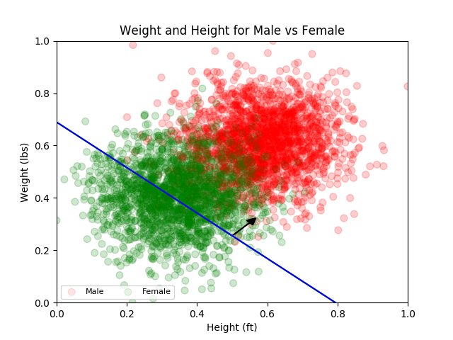{#id .class width=300 height=200} \ 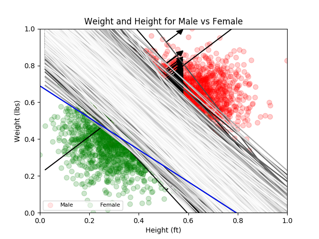{#id .class width=300 height=200} 

\ 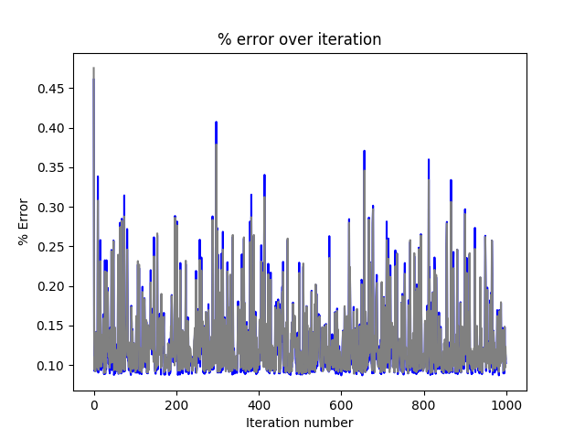{#id .class width=300 height=200} \ 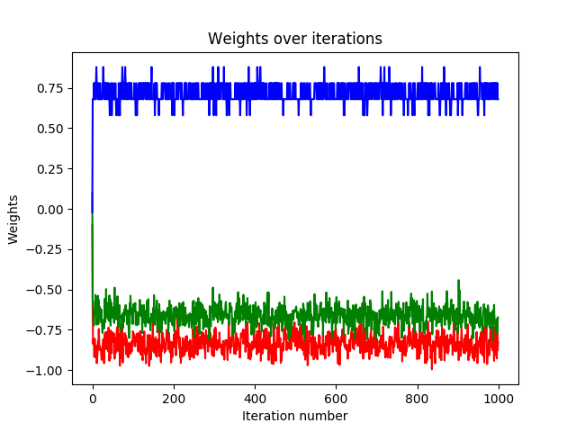{#id .class width=300 height=200} 

\pagebreak

### Hard Activation With A Sample Size Of 75%

\ 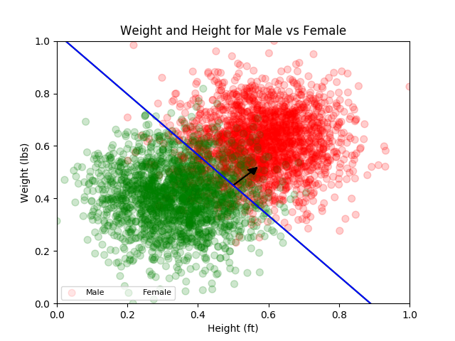{#id .class width=300 height=200} \ 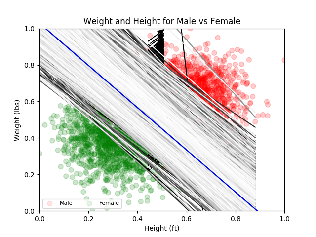{#id .class width=300 height=200} 

\ 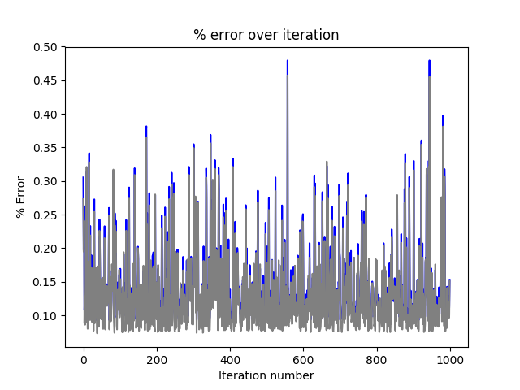{#id .class width=300 height=200} \ 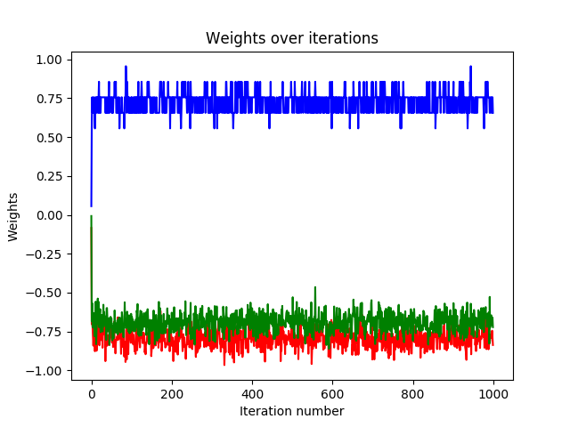{#id .class width=300 height=200} 

\pagebreak

### Soft Activation With A Sample Size Of 25%

\ 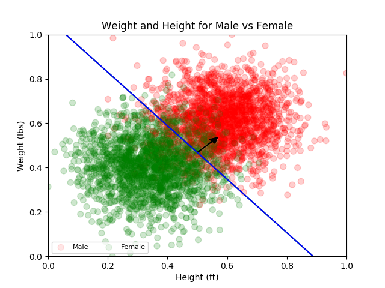{#id .class width=300 height=200} \ 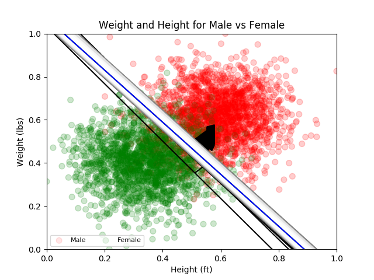{#id .class width=300 height=200} 

\ 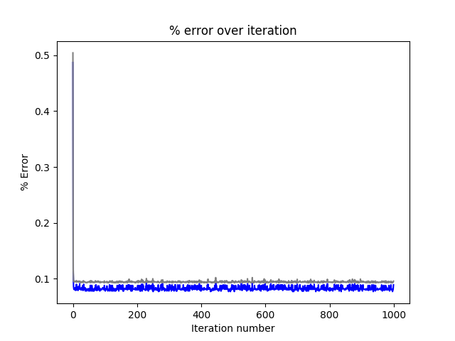{#id .class width=300 height=200} \ 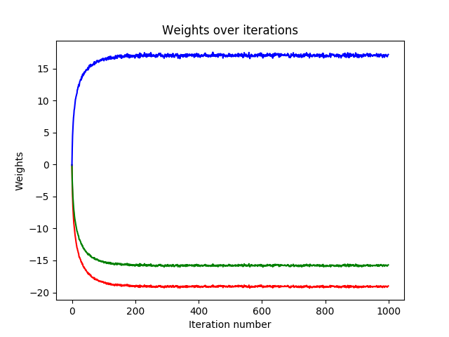{#id .class width=300 height=200} 

\pagebreak

### Soft Activation With A Sample Size Of 50%

\ {#id .class width=300 height=200} \ 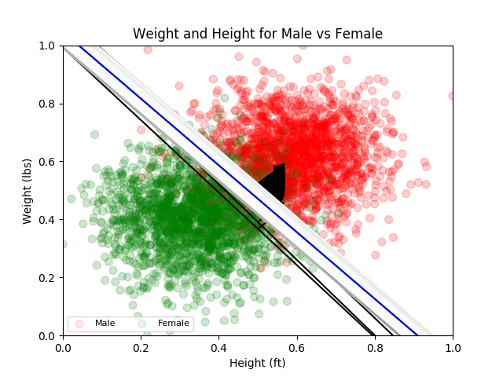{#id .class width=300 height=200} 

\ 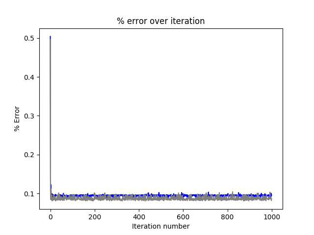{#id .class width=300 height=200} \ {#id .class width=300 height=200} 

\pagebreak

### Soft Activation With A Sample Size Of 75%

\ {#id .class width=300 height=200} \ 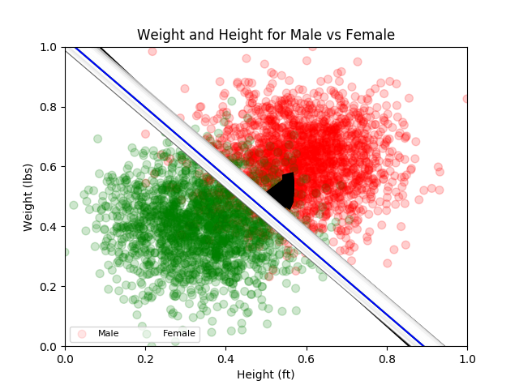{#id .class width=300 height=200} 

\ 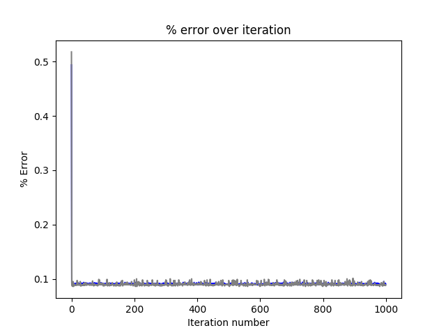{#id .class width=300 height=200} \ 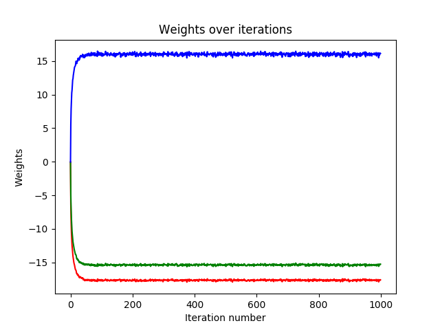{#id .class width=300 height=200} 

\pagebreak

