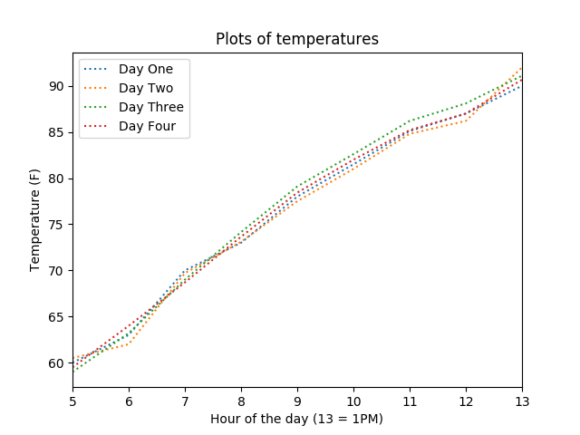

# Project 3 Report

## CMSC 409 - Artificial Intelligence

## Steven Hernandez

1. There would be two input and one output for our unit.
Inputs would be the hour and a bias input while output would be the estimated
temperature at that hour of the day.
In fact, because we have weights for x (hour of the day) and a bias,
we can create the formula net = ax+b which means our unit can simply return net * 1
or the identity.

2. The activation function would be some linear function.
Or unit would not have a threshold however.
Whatever the outcome from the linear activation function is
would be the exact result from the learning unit.
If we look at the graph of temperatures for our training
(and testing) data, we can see that the values are basically
just a linear function.

\ {#id .class width=300 height=200} 

3. Outcome of training with days 1-3:

Euclidean distance comes down from 223.433536 to 3.789658

\ {#id .class width=300 height=200} 

resulting in an activation as so:

\ {#id .class width=300 height=200} 

4.

| input | expected output | actual output | Euclidean distance | 
| --- | --- | --- | --- | 
| 5 | 59.5 | 60.9108715013 | 1.41087150129 | 
| 6 | 64 | 64.8531267022 | 0.8531267022 | 
| 7 | 68.7 | 68.7953819031 | 0.0953819031114 | 
| 8 | 73.65 | 72.737637104 | -0.912362895977 | 
| 9 | 78.43 | 76.6798923049 | -1.75010769507 | 
| 10 | 82 | 80.6221475058 | -1.37785249415 | 
| 11 | 85.2 | 84.5644027068 | -0.635597293242 | 
| 12 | 87 | 88.5066579077 | 1.50665790767 | 
| 13 | 90.67 | 92.4489131086 | 1.77891310858 | 

5. Learning rate was 0.0005 to keep the learning from going to quickly,while we went through 100 iterations.

Notice from the graph above on Euclidean distances, we reach our peak around the 20th iteration mark

6. As such, after the 20th iteration, we reach a plateau of improvement with our current system.

7. Using a more complex network with greater than one unit would allow for more complex outputwhich would ultimately help us with this problem.

Currently, we are stuck with a linear output because the single unit can only learn as such.

